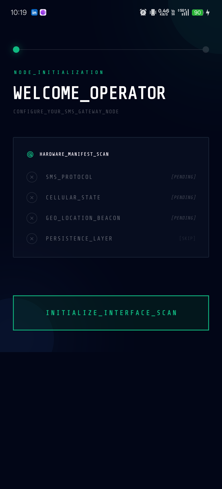
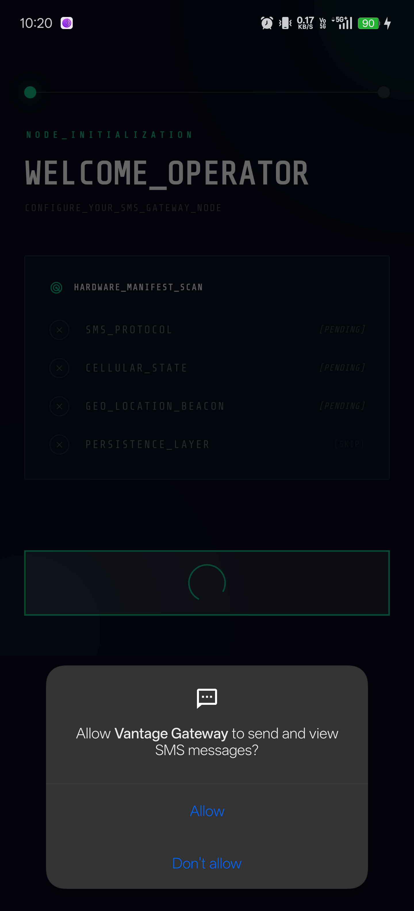
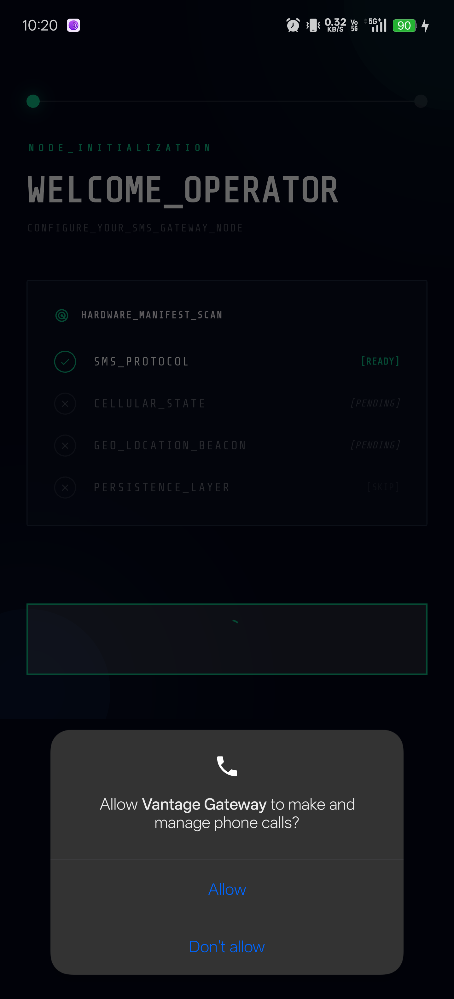
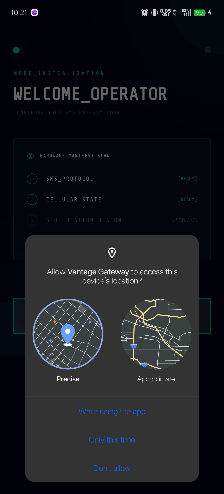
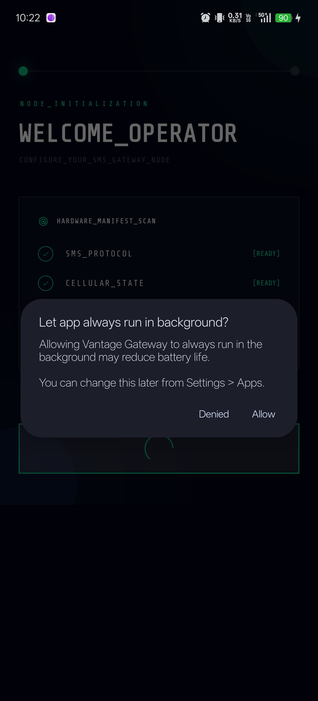
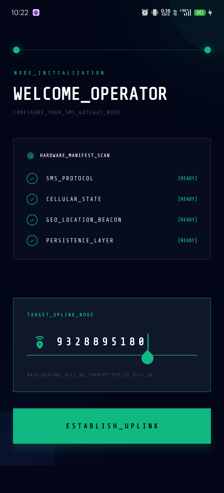
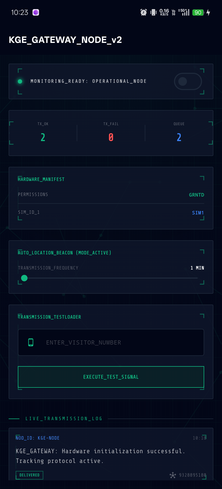

# KGE SMS Gateway (Vantage Gateway)

A high-performance Flutter application that transforms an Android device into a professional SMS monitoring and telemetry node.

## 📡 Overview
Vantage Gateway is designed to monitor SMS traffic, audit SIM card hardware, and broadcast GPS telemetry. It is built for reliability and runs as a foreground service to ensure constant uptime.

## ⚡ Key Features
- **SMS Monitoring**: Real-time tracking and logging of incoming and outgoing SMS messages.
- **SIM Hardware Auditing**: Access detailed information about the SIM carrier and cellular network state.
- **GPS Telemetry**: Automatically send location updates at configurable time intervals.
- **Background Service**: Uses Android Foreground Services to stay active even when the app is in the background.
- **Industrial Dashboard**: A clean, technical interface for monitoring all system activities in real-time.

## 📸 Screenshots

| Welcome | Permissions | SMS Audit |
|--|--|--|
|  |  |  |

| Location | Permissions Final | Number Entry |
|--|--|--|
|  |  |  |

| Monitoring Dashboard |
|--|
|  |

## 🛠️ Tech Stack
- **Framework**: Flutter (Dart)
- **State Management**: GetX
- **Native Integration**: Kotlin (Method Channels for SMS & SIM data)
- **Background Tasks**: Flutter Foreground Task
- **Animations**: Flutter Animate

## 🚀 Getting Started
1. **Clone the project**:
   ```bash
   git clone https://github.com/Akash-ptl/kge_sms.git
   ```
2. **Install dependencies**:
   ```bash
   flutter pub get
   ```
3. **Run the app**:
   ```bash
   flutter run
   ```

---
**Note**: This app requires SMS, SIM, and Location permissions to function correctly as a gateway node.
